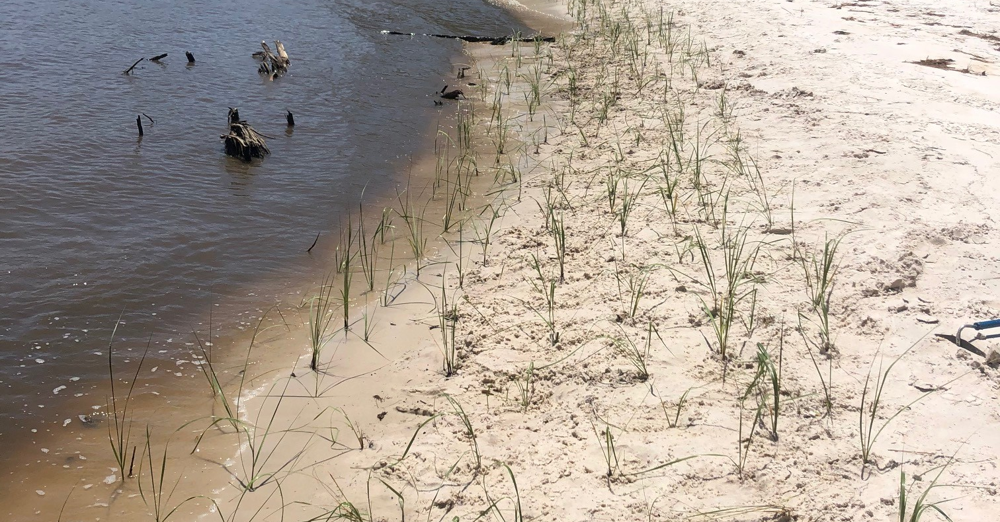
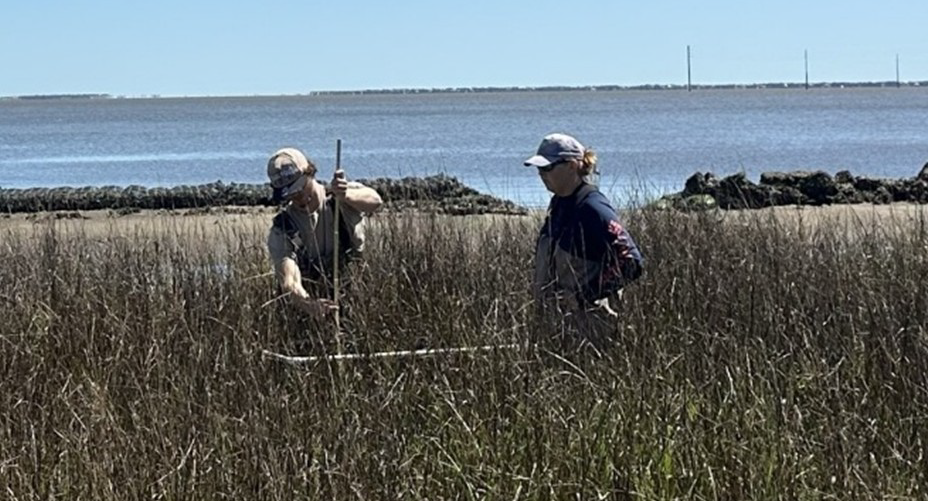
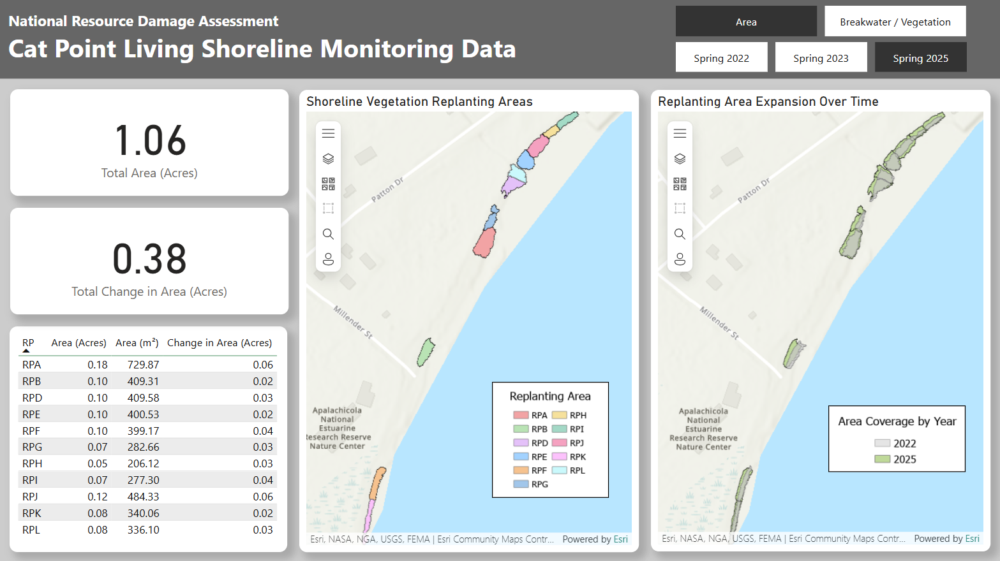

<h1 align="center">Cat Point Living Shoreline Restoration Project</h1>

## Project Overview
The Cat Point Living Shoreline Project is part of the Deepwater Horizon Phase III Early Restoration initiative. Following the 2010 Deepwater Horizon oil spill and the associated response efforts, benthic secondary productivity and salt marsh habitats along Florida’s Panhandle experienced significant damage. This project aims to restore and enhance reef and salt marsh habitats to help compensate the public for ecological injuries and losses resulting from the spill.

A living shoreline is a natural and sustainable approach to shoreline stabilization that utilizes native vegetation, oyster reefs, and other natural materials to reduce erosion, improve water quality, and support fish and wildlife habitat.

## Restoration Work

  

The Cat Point Living Shoreline project employs living shoreline techniques that utilize natural breakwater material to reduce shoreline erosion, provide habitat, and protect recovering salt marshes at Cat Point, Florida. The living shoreline breakwaters were constructed in 2019-2020 at the Apalachicola National Estuarine Research Reserve (ANERR) in Eastpoint, Florida, in Franklin County. The specific breakwater elevation and design was selected to maximize shoreline protection and meet state regulatory requirements. The living shoreline techniques were employed along approximately 0.3 miles of shoreline. This area has been the location of previous successful living shoreline projects that contribute to shoreline protection. 

Saltmarsh cordgrass, saltmeadow cordgrass, and sea oats were planted in suitable locations landward of the breakwaters in late spring 2020. Because of wash-out events and plant die-offs, additional saltmarsh cordgrass planting occurred in early 2021 and 2022.

## Why It Matters 
Living shorelines provide a wide range of environmental benefits, such as: 

• Preventing Coastal Erosion  
• Providing habitat for both terrestrial and marine life  
• Improving water quality  

In addition to these environmental services, living shorelines also offer industrial and economic advantages. Living shorelines both stabilize coastal land and reduce wave energy, aiding in the preservation of coastal properties and businesses, especially during extreme weather events such as severe storms and hurricanes.

## Monitoring

  

To track the progress of the restoration work done for the Cat Point Living Shoreline project, we’ve been conducting site monitoring on our breakwaters and vegetation planting sites over the past several years. This has included:

### Breakwater: 
We conduct bivalve monitoring on each of our 16 breakwaters to determine bivalve species composition, density, and size distribution. This consists of placing a quadrat at 9 different locations on our breakwaters, and within them noting the number of oysters, the percentage of the quadrat they cover, and their relative size class (spat, seed, or adult). We also approximate the amount of dead oysters found in each quadrat. 

### Epifauna:
To determine the epifauna species composition of our breakwaters, we place sediment trays filled with granite and oyster shell at a random location on each breakwater. These trays act as mini habitats that effectively replicate the inside of our breakwaters, allowing us to get an idea of the epifauna types and abundance in each of our 16 breakwaters. Sediment trays are then collected, and all of the species contained within them are identified and measured for analysis.

### Vegetation:
We also conduct vegetation monitoring at each of our 11 planting sites. We record average plant height and total area coverage, as well as note other factors such as sediment type and the presence of any species of importance.

### Marsh Spatial Extent:
To track how much the marsh is expanding, we walk around the planted areas with a GPS device to map their size. This mapping is done to determine the planting areas' spatial extent and change in area since previous years. 

  

Along with the annual monitoring reports that are published by CPAP, an [interactive PowerBI dashboard](https://app.powerbi.com/view?r=eyJrIjoiZjUwZDkwZTctNzdlYi00MzY0LWE2NjQtOTY0NzQ5YWJlNGVjIiwidCI6ImI2MjAxOTYwLTQ1YmEtNGI3OC1iMDgwLWYxYzQzM2ZmNmUzNiIsImMiOjZ9) was created which enables users to explore our monitoring data through dynamic visuals, making the complex data more accessible and engaging— far beyond what static graphs or traditional reports can offer.

## Results 
### Breakwater
For our breakwater monitoring, the original goal was for the reef structures to maintain or exceed their original size and height by Year 5. As of Year 2, all standard breakwaters had an average height at or above the original constructed height of 0.69 meters. Monitoring will continue to confirm if this remains true through Year 5.

### Epifauna
By Year 2, we were hoping to see oysters and other bivalves cover at least 50% of the breakwater surface. Unfortunately, this target was not met. In Year 2, the average coverage was approximately 38.7%. By Year 4 (2025), this improved slightly to about 43.5%, but the goal still remains unmet.

### Vegetation
The goal for our vegetation surveys was to see at least 80% of planted grasses survive by the end of the first growing season. This target was not met, with average survival at 70%.
Another goal was for vegetation to reach at least 80% of its original planted cover by Year 1, and 75% total cover within the site by Year 5. As of:

• Year 1: Percent cover was 69.9%, below the target.  
• Year 3 (current): Percent cover is estimated at 69.5%. Monitoring will continue to track progress toward the Year 5 goal.  

### Marsh Spatial Extent: 
In 2021, a total of 0.338 acres of vegetation had been planted. The original goal set for this restoration project was for the total marsh area to expand to 1 acre. As of March 2025, that goal has been exceeded at 1.06 acres of marsh area recorded. Continued expansion of the current RPs is expected to occur.

## Quick Links

### Central Panhandle Aquatic Preserves Main Page:
• [CPAP](https://matt-law12.github.io/cpap/)

### Other Projects:
• [Florida Oyster Cultch Placement Restoration Project](https://matt-law12.github.io/CPAP_NRDA_Oyster_Project/)  
• [Florida Seagrass Recovery Project](https://app.powerbi.com/view?r=eyJrIjoiZjUwZDkwZTctNzdlYi00MzY0LWE2NjQtOTY0NzQ5YWJlNGVjIiwidCI6ImI2MjAxOTYwLTQ1YmEtNGI3OC1iMDgwLWYxYzQzM2ZmNmUzNiIsImMiOjZ9)  
• [CPAP YSI Continual Water Quality Monitoring](https://matt-law12.github.io/cpap_wq/)  

### Data Dashboards:
• [Florida Oyster Cultch Placement Restoration Project](https://app.powerbi.com/view?r=eyJrIjoiODhhZGQxZmYtYjYzYy00MTQ0LWI3M2EtZmE3NzdlODdlOGE3IiwidCI6ImI2MjAxOTYwLTQ1YmEtNGI3OC1iMDgwLWYxYzQzM2ZmNmUzNiIsImMiOjZ9)  
• [Cat Point Living Shoreline Restoration Project](https://app.powerbi.com/view?r=eyJrIjoiZDMzNzc2ZGUtZDM5NC00NzE4LWE3ZTQtZWJkOTIyNjMxZDA5IiwidCI6ImI2MjAxOTYwLTQ1YmEtNGI3OC1iMDgwLWYxYzQzM2ZmNmUzNiIsImMiOjZ9)  
• [Florida Seagrass Recovery Project](https://app.powerbi.com/view?r=eyJrIjoiZjUwZDkwZTctNzdlYi00MzY0LWE2NjQtOTY0NzQ5YWJlNGVjIiwidCI6ImI2MjAxOTYwLTQ1YmEtNGI3OC1iMDgwLWYxYzQzM2ZmNmUzNiIsImMiOjZ9)  
• [CPAP YSI Continual Water Quality Monitoring](https://app.powerbi.com/view?r=eyJrIjoiZGUzNTIyZGMtNjhjMy00NWVmLWJmMGItMmQ3ZWZjZTkxMjY5IiwidCI6ImI2MjAxOTYwLTQ1YmEtNGI3OC1iMDgwLWYxYzQzM2ZmNmUzNiIsImMiOjZ9)  
